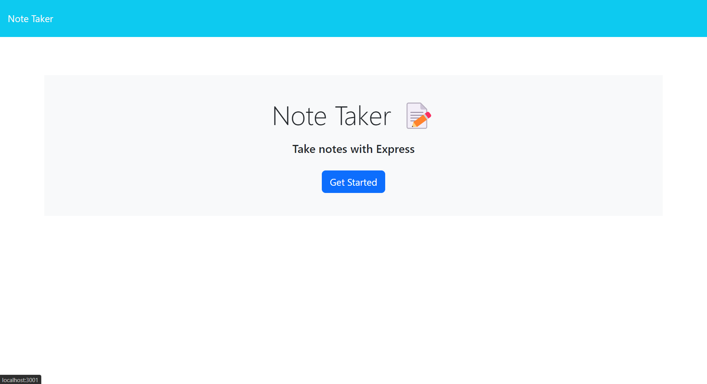
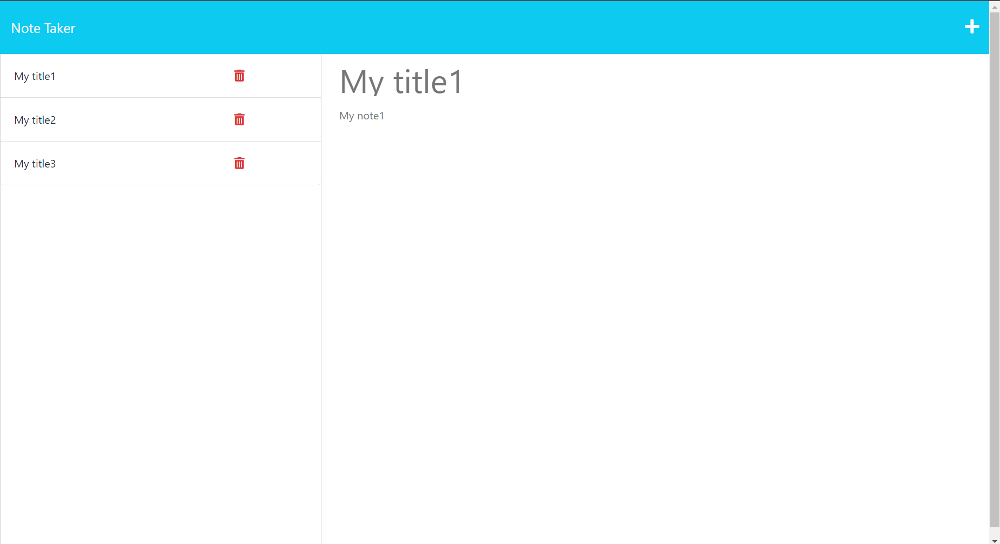
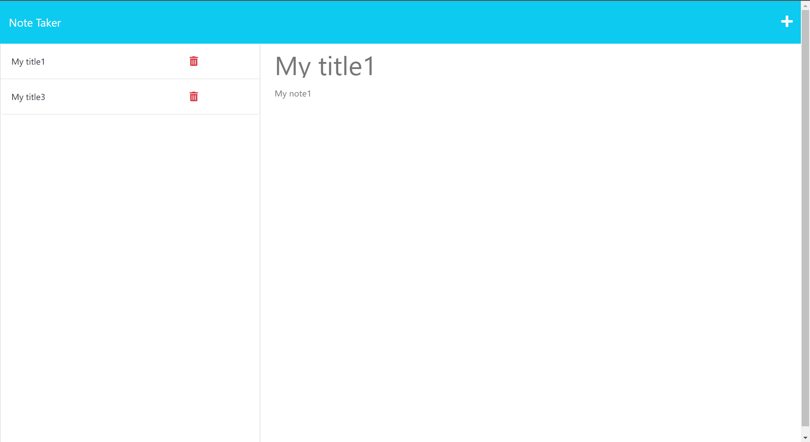

# Note Taker

## User Story
AS A small business owner
I WANT to be able to write and save notes
SO THAT I can organize my thoughts and keep track of tasks I need to complete

## Description
 Note taker starts from UI application that accepts title and notes. User starts add title and notes enter information in inputs. This information is added to the left sections. If user click on an existing note in the list in the left-hand column that note appears in the right-hand column. User can remove some notes from note taker for this user should press recycle bin icon.  

## Github reference
https://github.com/secretariuss/note-taker

## Video reference
https://

## Screen shots

The following scrshots shows the web application's:

## Acceptance Criteria
GIVEN a note-taking application
WHEN I open the Note Taker
THEN I am presented with a landing page with a link to a notes page
WHEN I click on the link to the notes page
THEN I am presented with a page with existing notes listed in the left-hand column, plus empty fields to enter a new note title and the note’s text in the right-hand column
WHEN I enter a new note title and the note’s text
THEN a Save icon appears in the navigation at the top of the page
WHEN I click on the Save icon
THEN the new note I have entered is saved and appears in the left-hand column with the other existing notes
WHEN I click on an existing note in the list in the left-hand column
THEN that note appears in the right-hand column
WHEN I click on the Write icon in the navigation at the top of the page
THEN I am presented with empty fields to enter a new note title and the note’s text in the right-hand column

  ## Table of Contents
  * [Installation](#installation)
  * [Usage](#usage)
  * [How to Contribute](#how-to-contribute)
  * [Tests](#tests)
  * [Questions?](#questions)
  
  ## Installation
  Use in the terminal, clone from github, run npm install
  ## Usage
  run in terminal npm run start
  ## How to Contribute
  [Contributor Covenant](https://www.contributor-covenant.org/)  
  In contributor covenant
  ## Tests
  run npm run test in terminal
  ## Questions?
  ### Reach me here: 
  [secretariuss](https://github.com/secretariuss)  
  secretarius@ukr.net